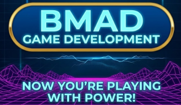
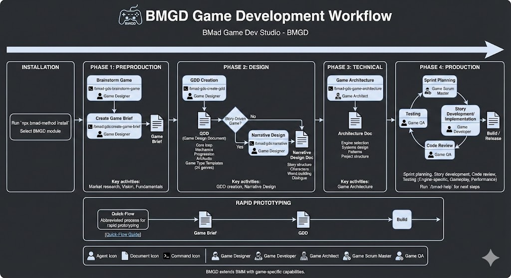

# BMGD Quick Guide

BMad Game Dev Studio (BMGD) extends BMM with game-specific capabilities. Developed by game industry veterans, it guides you through product research, technical design, narrative design, and a full epic-driven production cycle.

## Under Construction

Documentation is under heavy construction catching up with the new beta release. We'll have complete documentation up as soon as possible. For now, please ask in the BMGD section of the Discord if you have any questions.

## Quick Start

**Install → Game Brief → GDD → (Narrative) → Architecture → Build**

BMGD is an optional module installed via BMAD Method: `npx bmad-method install`

See [How-To Reference](#how-to-reference) for commands.

## Development Phases

| Phase | Name | Key Activities |
|-------|------|----------------|
| 1 | **Preproduction** | Brainstorm Game, Game Brief, market research |
| 2 | **Design** | GDD creation, Narrative Design (for story-driven games) |
| 3 | **Technical** | Game Architecture (engine, systems, patterns) |
| 4 | **Production** | Sprint planning, story development, code review, testing |

## BMGD Agents

| Agent | Purpose |
|-------|---------|
| Game Designer | Game mechanics, balance, player psychology |
| Game Developer | Implementation with engine-specific patterns |
| Game Architect | Engine selection, systems design, technical structure |
| Game Scrum Master | Sprint planning and epic management |
| Game QA | Playtesting, engine-specific testing, performance profiling |
| Game Solo Dev | Full-stack game development for solo projects |

## Key Documents

| Document | Purpose |
|----------|---------|
| **Game Brief** | Vision, market positioning, fundamentals |
| **GDD** | Core loop, mechanics, progression, art/audio direction |
| **Narrative Design** | Story structure, characters, world-building, dialogue |
| **Architecture** | Engine, systems, patterns, project structure |

## Game Type Templates

BMGD includes 24 game type templates that auto-configure GDD sections:

Action, Adventure, Puzzle, RPG, Strategy, Simulation, Sports, Racing, Fighting, Horror, Platformer, Shooter, and more.

Each template provides genre-specific GDD sections, mechanics patterns, testing considerations, and common pitfalls to avoid.

## Explanation: BMGD vs BMM

### When to Use Each

| Use BMGD for | Use BMM for |
|--------------|-------------|
| Video games | Web applications |
| Interactive experiences | APIs and services |
| Game prototyping | Mobile apps (non-game) |
| Game jams | General software projects |

### Phase Mapping

| BMM Phase | BMGD Phase | Key Difference |
|-----------|------------|----------------|
| Analysis | Preproduction | Game concepts, Game Brief instead of Product Brief |
| Planning | Design | GDD instead of PRD; optional Narrative Design |
| Solutioning | Technical | Focus on engine selection, game-specific patterns |
| Implementation | Production | Game QA replaces TEA; engine-specific testing |

### Document Differences

| BMM | BMGD | Notes |
|-----|------|-------|
| Product Brief | Game Brief | Captures vision, market, fundamentals |
| PRD | GDD | Includes mechanics, balance, player experience |
| N/A | Narrative Design | Story, characters, world (story-driven games) |
| Architecture | Architecture | BMGD version includes engine-specific patterns and considerations |

### Testing Differences

**BMM (TEA):** Web-focused testing with Playwright, Cypress, API testing, E2E for web apps.

**BMGD (Game QA):** Engine-specific frameworks (Unity, Unreal, Godot), gameplay testing, performance profiling, playtest planning, balance validation.

## How-To Reference

| I need to... | Action                                                                                                 |
|--------------|--------------------------------------------------------------------------------------------------------|
| Install BMGD | Run `npx bmad-method install` and select BMGD during module installation                               |
| Start a new game | Run `/bmad-gds-brainstorm-game`, then `/bmad:gds:create-game-brief`                                    |
| Design my game | Run `/bmad-gds-create-gdd`; add `/bmad:gds:narrative` if story-heavy                                   |
| Plan architecture | Run `/bmad-gds-game-architecture` with Game Architect                                                  |
| Build my game | Use Phase 4 production workflows - Run `/bmad-help` to see what's next                       |
| Test an idea quickly | Use [Quick-Flow](quick-flow-workflows.md) for rapid prototyping |

## Further Reading

- [Game Types Guide](game-types.md)
- [Quick-Flow Guide](quick-flow-workflows.md)

